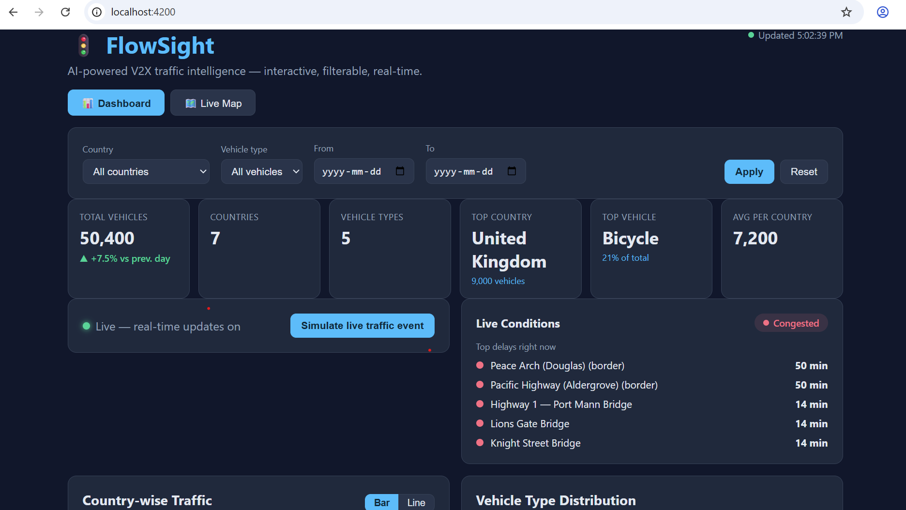
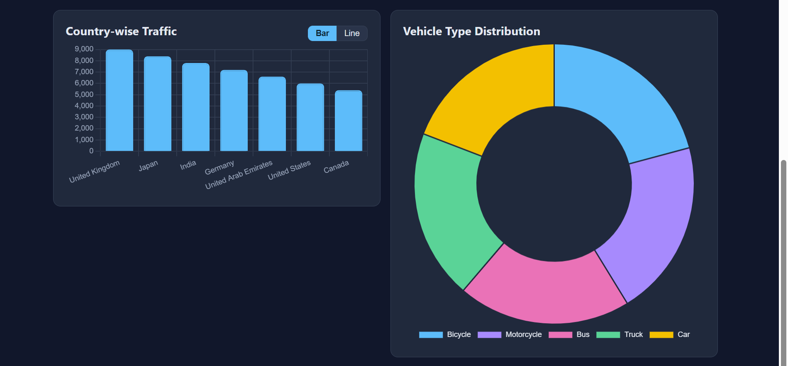
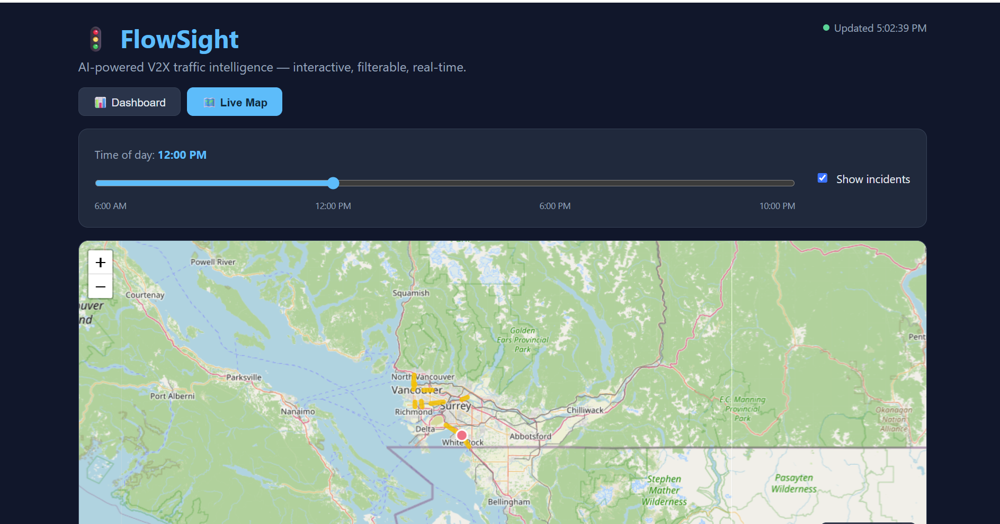
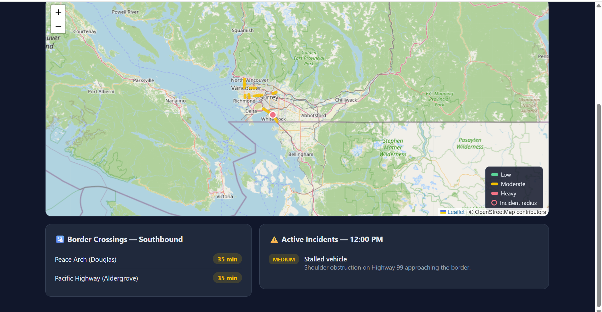

# FlowSight — Real-time Traffic Visualization
FlowSight is a real-time web application for visualizing traffic information. It displays interactive, filterable charts based upon country and vehicle type distribution; it also provides an interactive map to visualize traffic congestion. FlowSight was developed using a .Net 8 Web API, Angular 17 front-end, PostgreSQL database, and SignalR for real-time updates.

---


## Features

- Two interactive charts (bar and pie) developed using Chart.js. Both charts include KPI summary cards, a bar-line toggle, and active filters.
- Data can be filtered on the server-side by country, vehicle type and date range. 
- Real-time updates: whenever new traffic events occur, they will be pushed to all connected clients through SignalR and displayed immediately in animated chart form.
- Live traffic map of Vancouver and road timed segment colored by green/yellow/red. Time-travel slider (6AM-12PM-6PM-10PM), a radius indicating impact of an incident and border crossing wait time. 
- Clean, responsive, dark-themed UI,
- Docker Compose stack (DB + API + front-end). 
- CI pipeline (GitHub Actions) for building and testing both halves.
- Unit tests on both halves (xUnit + Jasmine/Karma).


---

## Assumptions
Data is seeded, not pulled from a live feed. 


## Architecture overview
```
┌──────────────┐    HTTPS / WebSocket    ┌───────────────────┐    EF Core    ┌────────────┐
│  Angular 17  │  ───────────────────▶   │   .NET 8 Web API  │  ─────────▶   │ PostgreSQL │
│  (Chart.js)  │   REST  /api/traffic    │  Controllers      │   Npgsql      │            │
│              │ ◀───────────────────    │  Service layer    │  ◀─────────   │            │
│  SignalR     │   /hubs/traffic push    │  SignalR hub      │               │            │
└──────────────┘                         └───────────────────┘               └────────────┘
```
## design decisions
- choose to do aggregation in sql in stead of doing it on the client side.Since the db already stores the records, it makes sense to calculate totals,average and summarise them. 
- i used SignalR for live update because traffic datais time sensitive.Instead of making the frontend repeat calls to the API which will further leads to error. This thing makes it more real-time
-I used seed data because my objective was to show the application design, structure and logic and the dashboard features.It is easy to test as well.


- The front end requests data from `GET /api/traffic` and displays it.
- The API combines `TrafficRecord` rows in the database. All filtering and grouping happens in SQL, keeping payloads small.
- When a new record is submitted, the API saves it and **broadcasts** the updated dashboard through the SignalR hub.


---

## Project layout

```
FlowSight/
├─ backend/
│  ├─ FlowSight.Api/      # .NET 8 Web API (models, EF Core, services, hub)
│  ├─ FlowSight.Tests/    # xUnit tests
│  └─ FlowSight.sln
├─ frontend/
│  └─ flowsight-web/      # Angular 17 app + Jasmine specs
├─ docs/                   # LaTeX source + compiled PDF
├─ .github/workflows/ci.yml
└─ docker-compose.yml
```

---

## Running with Docker, 
we can use aspire as well but in the docs it was mentioned to use docker,

Requires Docker + Docker Compose.

```bash
docker compose up --build
```

- Front end: <http://localhost:8081>
- API + Swagger: <http://localhost:5000/swagger>
- PostgreSQL: `localhost:5432` (db `flowsight`, user/pass `postgres`)

The API applies EF Core migrations and seeds the  data 

---

## Running locally (without Docker)

### 1. Database

Start a PostgreSQL 16 instance and ensure these credentials match
`backend/FlowSight.Api/appsettings.json` (or override the
`ConnectionStrings__Default` environment variable):

```
Host=localhost;Port=5432;Database=flowsight;Username=postgres;Password=****
```

### 2. Backend

```bash
cd backend
dotnet restore
dotnet run --project FlowSight.Api
# API on http://localhost:5000  (Swagger at /swagger)
```

Migrations run and seed data is inserted automatically at startup.

```bash
dotnet tool install --global dotnet-ef        # once
dotnet ef database update --project FlowSight.Api
```

### 3. Frontend

```bash
cd frontend/flowsight-web
npm install
npm start
# App on http://localhost:4200
```

---

## API reference

| Method | Route                  | Description                                              |
|--------|------------------------|----------------------------------------------------------|
| GET    | `/api/traffic`         | Aggregated dashboard data. Query: `countryId`, `vehicleTypeId`, `from`, `to`. |
| GET    | `/api/traffic/filters` | Available countries and vehicle types for the filters.   |
| POST   | `/api/traffic`         | Ingest a new traffic record; broadcasts a live update.   |
| GET    | `/api/map`             | Live-map data for an hour bucket (`?hour=6\|12\|18\|22`): road segments with congestion level, incidents, and border waits. |
| WS     | `/hubs/traffic`        | SignalR hub; emits `DashboardUpdated`.                    |

Example:

```bash
curl "http://localhost:5000/api/traffic?countryId=2&from=2026-06-01&to=2026-06-09"
```

---

## Running the tests

Backend:

```bash
cd backend
dotnet test
```

Frontend:

```bash
cd frontend/flowsight-web
npm run test
```

---

## Scalability (5 → 50 → 500 RPS)

- **5 RPS** — a single API instance and a single PostgreSQL instance are
  sufficient
- **50 RPS** — run several stateless API replicas behind a load balancer,
  add a Redis response cache for the aggregation endpoint, tune EF Core
  connection pooling, and use a Redis **backplane** so SignalR works across
  replicas.
- **500 RPS** — auto-scale API pods (Kubernetes), add PostgreSQL read
  replicas and route reads to them, serve the Angular bundle from a CDN,
  pre-compute heavy aggregates via materialized views, and move ingestion
  behind a message queue to smooth write spikes


---
## Screenshots

### Dashboard



### Live Traffic Map




